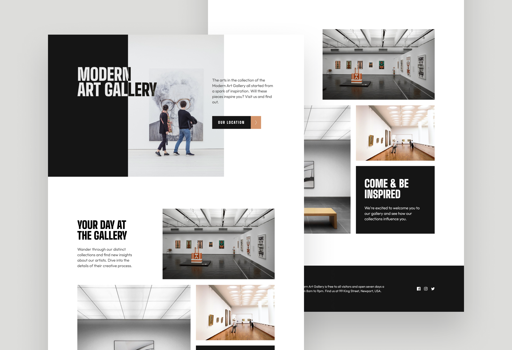

# Art Gallery Website

## Welcome! 👋

Thanks for checking out this front-end coding project.

## Table of contents

- [Overview](#overview)
  - [The project](#the-project)
  - [Links](#links)
- [My process](#my-process)
  - [Built with](#built-with)
  - [Continued development](#continued-development)

## Overview

### The project

Users should be able to:

- View the optimal layout for each page depending on their device's screen size
- See hover states for all interactive elements throughout the site
- **Bonus**: Use [Leaflet JS](https://leafletjs.com/) or [Google Maps JavaScript API](https://developers.google.com/maps/documentation/javascript/overview) to create an interactive location map with custom location pin

### Links

- Live Site URL: [Here](https://art-gallery-website-iota.vercel.app/)

## My process

### Built with

- Semantic HTML5 markup
- Flexbox
- CSS Grid
- Mobile-first workflow
- [React](https://reactjs.org/) - JS library
- [Tailwind](https://tailwindcss.com/) - CSS framework
- [Motion](https://motion.dev/) - Animation library
- [Google Maps JavaScript API](https://developers.google.com/maps/documentation/javascript/overview) - Google Maps API

### Continued development

TBD 🚀
